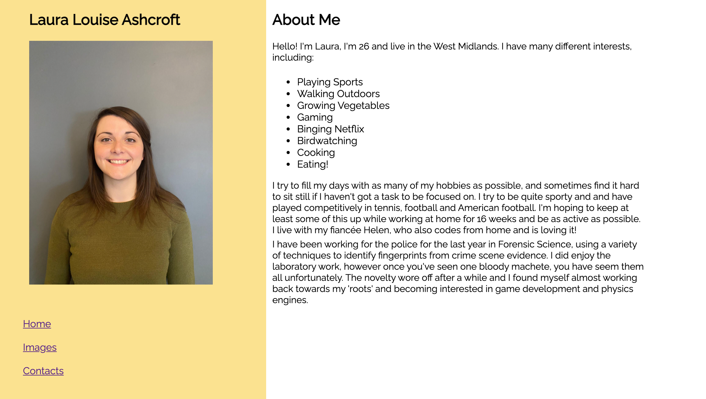

# MY FIRST WEBSITE

## A challenge given early on in my programming life, to create a website using only HTML

### Laura Ashcroft

<table>
<td></td>
<td></td>
</table>

## How to use

1. Navigate through the website using the links in the navigation bar.
2. Use the links to get to my social media pages!
3. Enjoy!

## Installation

1. Clone or download this repository.
2. Click 'Go Live' to view in browser.
